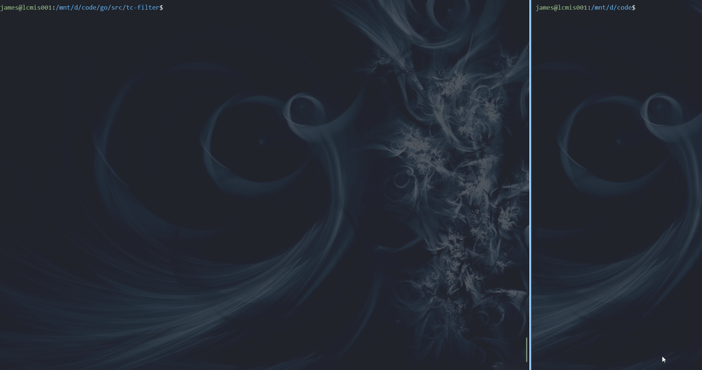

# tc-filter
Linux network filter base on ebpf tc




## Usage

```bash
./tc-filter --help

Usage of ./tc-filter:
  -drop-skb
        drop filtered skb
  -filter-dst-ip string
        filter destination IP addr
  -filter-dst-port value
        filter destination port
  -filter-if string
        filter net interface
  -filter-port value
        filter either destination or source port
  -filter-proto string
        filter L4 protocol (tcp, udp, icmp)
  -filter-src-ip string
        filter source IP addr
  -filter-src-port value
        filter source port
  -kernel-btf string
        specify kernel BTF file
```

## how to run

`tc-filter` requires >= 5.8 kernel to run.

install bpf2go

```bash
go install github.com/cilium/ebpf/cmd/bpf2go@latest
```

mount kernel debug folder

```bash
mount -t debugfs debugfs /sys/kernel/debug
```
re-generate bpf header files
```
ebpf/headers/update.sh
```

re-generate go file

```bash
make 

```

run program
```bash
sudo ./tc-filter
```
